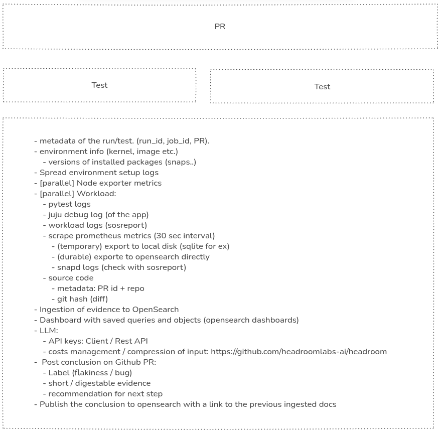

# Contributing

The current repository structure is a draft and should evolve over the lifetime of the project.

Please add:
- Github workflow automation to `.github/`
- Documentation or instructions for agentic engineering (`*.md`) to `docs/`
- scripts or simple tools for specific tasks to `scripts/`
- agentic skills that we use or develop to `skills/`
- snap recipies as subdirectories to `snaps/`
- tests that are created along the way into `tests`

## Architectural considerations

The following image contains a few architectural considerations for the project:

